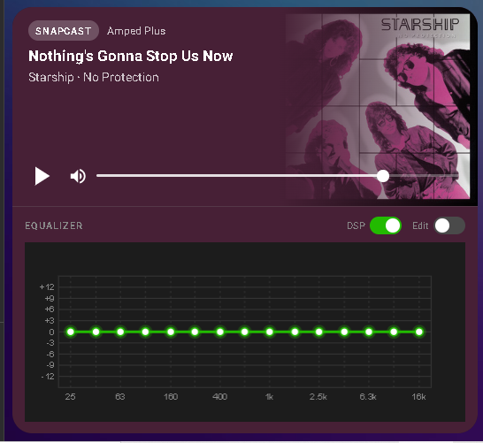

# Snapspot Media Player Card

[](https://github.com/hacs/integration)
[](https://github.com/farmed-switch/HA-Snapspot-Mediaplayer/releases)

A Lovelace card for Home Assistant built for [Snapspot](https://github.com/farmed-switch/esphome-snapspot) ESPHome audio devices. It pulls album art, track info, controls and DSP settings together in one card. No separate DSP card needed.



## What it does

You point it at a media player entity (Snapcast or Spotify) and the card automatically finds the matching sensors for track, artist, album, artwork and playback position. The EQ section scans for the device's equalizer band entities so you don't need to configure anything extra unless your entities have unusual names.

The DSP section shows an interactive EQ canvas with the actual band values from Home Assistant. You can toggle DSP on/off and drag the bands when edit mode is on.

## Features

- Album artwork as full-bleed background with color-extracted gradient overlay (matches the HA media control card style)
- Track, artist, album from ESPHome text sensors — auto-discovered from the media player prefix
- Progress bar with elapsed time and duration
- Play/Pause, volume slider, mute toggle
- Source badge (SNAPCAST / SPOTIFY) with optional manual source switcher bar
- DSP section with interactive 15-band EQ canvas
- DAC power toggle, DSP/EQ enable toggle — auto-detected from entity names
- Prev/Next buttons shown only when Spotify is active
- Visual editor in HA — no YAML required for basic setup

## Installation

### HACS (recommended)

1. Open HACS in Home Assistant, go to Frontend
2. Click the three-dot menu, then Custom repositories
3. Add `https://github.com/farmed-switch/HA-Snapspot-Mediaplayer` with category Lovelace
4. Install "Snapspot Media Player Card" and reload
5. Add the card to your dashboard — search for "Snapspot" in the card picker

### Manual

Download `dist/snapspot-mediaplayer-card.js` and add it as a Lovelace resource
(`/local/snapspot-mediaplayer-card.js`, resource type: JavaScript module).

## Configuration

The visual editor covers everything for most setups. If you prefer YAML:

```yaml
type: custom:snapspot-mediaplayer-card
media_player: media_player.livingroom_snapspot_louder_snapcast
title: Living room           # optional, defaults to friendly name
source_switch: true          # show Snapcast/Spotify switcher bar
show_dsp: true               # show EQ section below the player
dac_switch: switch.my_dac    # optional, only needed if auto-detection fails
```

### DSP / EQ section

When `show_dsp: true` the card shows an equalizer canvas below the player. It scans for entities matching `number.{prefix}_eq_*hz` so it works with both the louder and amped Snapspot variants automatically.

The header row has three toggles:

- DAC — controls the DAC power switch (auto-detected, or set `dac_switch` manually)
- DSP — toggles EQ on/off, works with both `select.*_dsp` (hardware) and `switch.*_software_eq` depending on which entity exists on your device
- Edit — enables dragging the EQ bands directly on the canvas

## Notes

Entity auto-discovery works off the media player entity ID prefix. Some devices have a doubled prefix in the entity ID (e.g. `...dev_bas_...dev_bas_snapcast`) — the card handles this for DAC and EQ entities using a reverse scan, but if something doesn't show up the `dac_switch` config option is there as a manual fallback.

The card is built for Snapspot devices specifically. It probably won't work with arbitrary media player integrations.

## License

MIT
